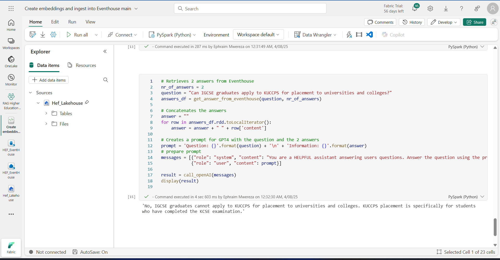

<!DOCTYPE html>
<html>
<body>
<h1> RAG-Powered Virtual Assistant for the Higher Education Fund (HEF) using Azure OpenAI and Microsoft Fabric Eventhouse </h1>    
<h2>Overview</h2>

RAG-Powered Virtual Assistant for the Higher Education Fund (HEF) is an AI-driven solution built using Azure OpenAI and Microsoft Fabric Eventhouse to streamline access to critical information on higher education funding in Kenya.

This application is a Retrieval-Augmented Generation (RAG) virtual assistant designed to help students, guardians, and other stakeholders easily access accurate and up-to-date information about Kenya's new Higher Education Fund (HEF) model. The assistant draws from an enriched knowledge base comprising FAQs and official documents from KUCCPS, HELB, and the Universities Fund, along with supplementary data extracted from their official websites.

With the introduction of the New Funding Model (NFM) in May 2023, many applicants are unfamiliar with the application processes, eligibility criteria, and the roles of the three institutions involved. The assistant bridges this knowledge gap by offering 24/7 conversational support, eliminating the need for time-consuming calls, emails, or in-person visits to the single UF office in Nairobi.

By automating responses to common queries, the virtual assistant not only improves the student experience but also reduces the workload on overwhelmed human support staff, ensuring equitable, timely, and consistent access to information—especially for students in remote areas.

<h2>Prerequisites</h2>
To follow this guide, you will need to ensure that you have access to the following services and have the necessary credentials and keys set up.
<ol>
<ul>Microsoft Fabric.</ul>
<ul>Azure OpenAI Studio to manage and deploy OpenAI models.</ul>
</ol>

<h2>Open AI models used:</h2>

<ul>
    <li>Model: gpt-4o-kenya-hack </li>
    <li>Model: text-embedding-ada-002-kenya-hack</li>
</ul>

<h2> How it works </h2>
<h3> Processing the files and indexing the embeddings </h3>

<strong> create the embeddings and then save them into our Vector Database – Fabric Eventhouse</strong>
<ol>
    <li> Read files from Fabric Lakehouse</li>
    <li> Create embeddings from the text using Azure OpenAI ada Embeddings model</li>
    <li> Save the text and embeddings in our Fabric Eventhouse DB</li>
</ol>

<h3> RAG - Getting answers </h3>

Every time we want to search for answers from our knowledge base, we will:
<ol>
    <li> Create the embeddings for the question and search our Fabric Eventhouse for the answers, using Similarity search</li>
    <li> Combining the question and the retrieved answers from our Vector Database, we will call Azure OpenAI GPT4 model to get “natural language” answer.</li>
   
</ol>

<h3>Setup</h3>

Create a Fabric Workspace

Create a lakehouse Workspace "Hef-lakehouse"

 Click on "Upload" to Upload pdfs from local storage to the "Hef-lakehouse"

Create an Eventhouse DB called “hef_eventhouse”

Click on the "HEF_EventHouse_queryset" to create the “hefEmbeddings” table.

Paste the following command and run it on the kql notebook

Import our notebook "Creating embeddings and ingesting into Eventhouse.ipynb" in the workspace

Grab your Azure openAI endpoint and secret key and paste it in the notebook, replace your models deployment names if needed.

 Put your working azure OpenAI endpoint and secret key where needed 

<ol>

<li>Get the Eventhouse URI and paste it as “KUSTO_URI” in the notebook</li>
<li>Connect the notebook to the Lakehouse <li>

<li>Let’s run our notebook</li>

<ol>

Let’s check the data was saved to our Vector Database.
Go to the Eventhouse and run this query

Output

 Go back to the note book and run the remaining cells

Try to pass your sample question to the app in the last cell. Any question regarding higher education funding in kenya

Sample Output

This documentation provides an overview of the PIInovators cloud-native data solution, outlining its architecture, components, objects, and pipeline activities. It serves as a comprehensive guide for understanding the solution's design and functionality.

<ul>
