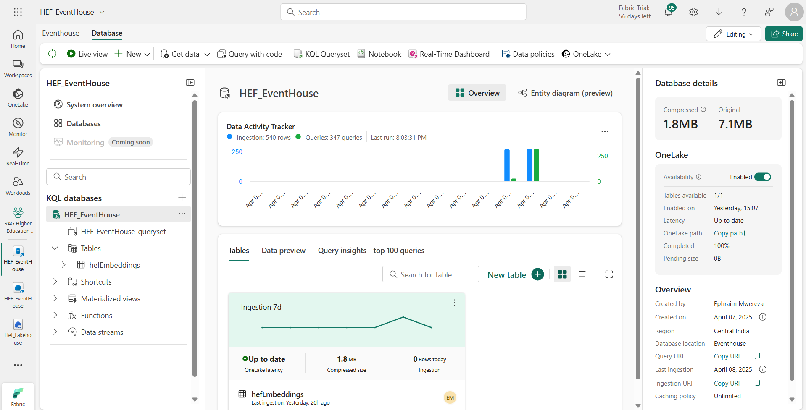
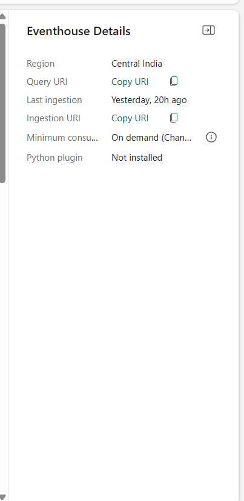

# RAG-Powered Virtual Assistant for the Higher Education Fund (HEF) using Azure OpenAI and Microsoft Fabric Eventhouse

## 📚 Table of Contents
- [Overview](#overview)
- [Features](#features)
- [Prerequisites](#prerequisites)
- [OpenAI Models Used](#openai-models-used)
- [How it Works](#how-it-works)
  - [Processing the Files and Indexing the Embeddings](#processing-the-files-and-indexing-the-embeddings)
  - [RAG - Getting Answers](#rag---getting-answers)
- [Setup](#setup)
- [🧪 Sample Output](#-sample-output)
- [📊 Conclusion](#conclusion)
- [📄 License](#license)
- [🤝 Contributing](#contributing)

## 🌍 Overview
The **RAG-Powered Virtual Assistant for the Higher Education Fund (HEF)** is an AI-driven solution built using **Azure OpenAI** and **Microsoft Fabric Eventhouse** to streamline access to critical information on higher education funding in Kenya.

It leverages **Retrieval-Augmented Generation (RAG)** to help students, guardians, and stakeholders easily access accurate, up-to-date information about Kenya's **Higher Education Fund (HEF)** model. The assistant uses FAQs and official data from **KUCCPS**, **HELB**, and the **Universities Fund**, supplemented with content from their official websites.

With the introduction of the **New Funding Model (NFM)** in May 2023, many applicants are unfamiliar with the new processes. The assistant bridges this knowledge gap by offering 24/7 conversational support, reducing dependency on emails, calls, and physical office visits.

## 🚀 Features
- Instant, 24/7 support for Higher Education Fund inquiries
- Uses trusted data from KUCCPS, UF, and HELB
- Reduces workload on support staff
- Eliminates the need for travel to major cities for information
- Ensures inclusive access for remote and underserved communities
- Built using cutting-edge Azure OpenAI and Microsoft Fabric technologies

## ✅ Prerequisites
Make sure you have access to the following services and credentials:
- Microsoft Fabric account
- Azure OpenAI Studio (model deployment permissions)
- Deployed Azure OpenAI resource (gpt & embeddings)
- Microsoft Fabric workspace setup with permissions

## 🧬 OpenAI Models Used
- `gpt-4o-kenya-hack` — For generating natural language answers
- `text-embedding-ada-002-kenya-hack` — For creating vector embeddings from documents

## 💡 How it Works

### 🔹 Processing the Files and Indexing the Embeddings

This process involves preparing the data and saving vector embeddings into Fabric Eventhouse:
1. Read PDF documents from the Fabric Lakehouse
2. Generate embeddings using the `ada-002` model
3. Store both the text and embeddings in the Eventhouse DB

### 🔹 RAG - Getting Answers

When a user asks a question:
1. The question is converted into an embedding and searched against the Vector DB in Fabric Eventhouse
2. Retrieved content is combined with the question and passed to GPT-4o to generate a natural language response

## 📅 Setup

### Step 1: Create a Fabric Workspace

### Step 2: Create a Lakehouse Workspace "hef-lakehouse"

### Step 3: Upload PDFs from local machine to the Lakehouse

### Step 4: Create an Eventhouse DB named "hef_eventhouse"

### Step 5: Create "hefEmbeddings" table
Click on `HEF_EventHouse_queryset` and run the command below:

### Step 6: Import and Configure the Notebook
- Import `Creating embeddings and ingesting into Eventhouse.ipynb`
- Add your Azure OpenAI endpoint and key
- Replace model deployment names if needed

### Step 7: Set KUSTO_URI and Connect Notebook to Lakehouse

### Step 8: Run Notebook and Test Ingestion

Verify data storage:

### Step 9: Run Final Cells and Ask Questions
Try asking a sample question in the final notebook cell.

## 🧪 Sample Output

**Example Input:**
> "How do I apply for funding under the new HEF model?"

**AI Response:**
> "To apply for HEF funding under the New Funding Model (NFM), students must complete the Means Testing Instrument (MTI) via the HEF portal. This ensures funding is allocated based on financial need..."

_See visual output below:_

## 📊 Conclusion
This documentation outlines the architecture, setup, and flow of a RAG-powered assistant tailored to Kenya's HEF system. It offers a scalable solution for delivering reliable and accessible support using AI and cloud technologies.

## 📄 License
This project is licensed under the [MIT License](LICENSE).

## 🤝 Contributing
We welcome contributions! Fork this repository, make your changes, and submit a pull request. For major changes, please open an issue first to discuss what you'd like to do.
