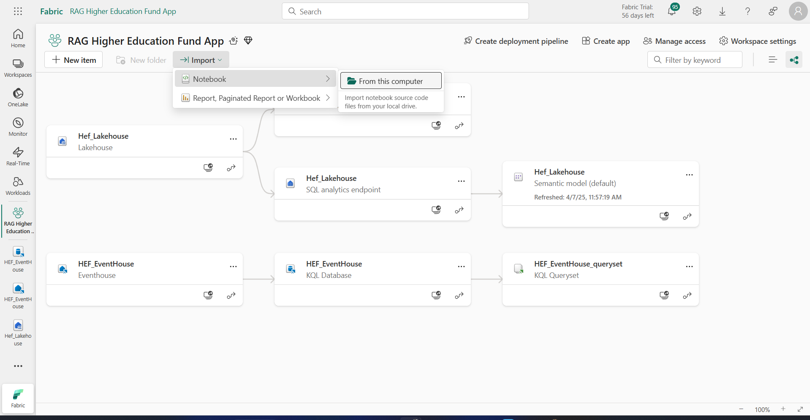

<!DOCTYPE html>
<html>
<body>
<h1> RAG-Powered Virtual Assistant for the Higher Education Fund (HEF) using Azure OpenAI and Microsoft Fabric Eventhouse </h1>    
<h2>Overview</h2>

PIInovators is a cloud-native data solution developed in Microsoft Fabric, integrating OpenAI for document analysis, particularly for detecting Personal Identification Information (PII) in files and images. The solution classifies documents into complaint and non-complaint categories, further categorizing them based on predefined types (Delivery, Personnel, Online, Continual, Communication). The solution is based on a medallion architecture where data is stored in three zones (Bronze, Silver, Gold) within Microsoft Fabric Lakehouse. Subsequently, the data is prepared for analytical use in Power BI reports.

<h2>Open AI models used:</h2>

<ul>
    <li>Model: gpt-4o-kenya-hack, Version: 1106-preview for files</li>
    <li>Model: text-embedding-ada-002-kenya-hack, Version: vision-preview for images</li>
</ul>

<h2> How it works </h2>
<h3> Processing the files and indexing the embeddings </h3>

<strong> create the embeddings and then save them into our Vector Database – Fabric Eventhouse</strong>
<ol>
    <li> Read files from Fabric Lakehouse</li>
    <li> Create embeddings from the text using Azure OpenAI ada Embeddings model</li>
    <li> Save the text and embeddings in our Fabric Eventhouse DB</li>
</ol>

<h3> RAG - Getting answers </h3>

Every time we want to search for answers from our knowledge base, we will:
<ol>
    <li> Create the embeddings for the question and search our Fabric Eventhouse for the answers, using Similarity search</li>
    <li> Combining the question and the retrieved answers from our Vector Database, we will call Azure OpenAI GPT4 model to get “natural language” answer.</li>
   
</ol>

<h3>Setup</h3>

Create a Fabric Workspace

Create a lakehouse Workspace "Hef-lakehouse"

 Click on "Upload" to Upload pdfs from local storage to the "Hef-lakehouse"

Create an Eventhouse DB called “hef_eventhouse”

Click on the "HEF_EventHouse_queryset" to create the “hefEmbeddings” table.

Paste the following command and run it on the kql notebook

Import our notebook "Creating embeddings and ingesting into Eventhouse.ipynb" in the workspace

Grab your Azure openAI endpoint and secret key and paste it in the notebook, replace your models deployment names if needed.

 Put your working azure OpenAI endpoint and secret key where needed 

<ol>

<li>Get the Eventhouse URI and paste it as “KUSTO_URI” in the notebook</li>
<li>Connect the notebook to the Lakehouse <li>

<li>Let’s run our notebook</li>

<ol>

Let’s check the data was saved to our Vector Database.
Go to the Eventhouse and run this query

Output

 Go back to the note book and run the remaining cells

Try to pass your sample question to the app in the last cell. Any question regarding higher education funding in kenya

Sample Output

This documentation provides an overview of the PIInovators cloud-native data solution, outlining its architecture, components, objects, and pipeline activities. It serves as a comprehensive guide for understanding the solution's design and functionality.

<ul>
